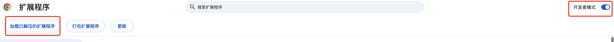

# 参考文章：

[两万字大章带你使用 Vue3、Vite、TypeScript、Less、Pinia、Naive-ui 开发 Chrome 浏览器 Manifest V3 版本插件](https://zhuanlan.zhihu.com/p/679804993 "两万字大章带你使用 Vue3、Vite、TypeScript、Less、Pinia、Naive-ui 开发 Chrome 浏览器 Manifest V3 版本插件") ：

创建一个简单的谷歌浏览器插件：

```
执行：npm i or yarn or pnpm i

执行：npm run build 打包

谷歌浏览器 -> 扩展程序 -> 管理扩展程序 -> 打开右上角开发者模式 -> 左上角加载工程打包后的dist文件


```
